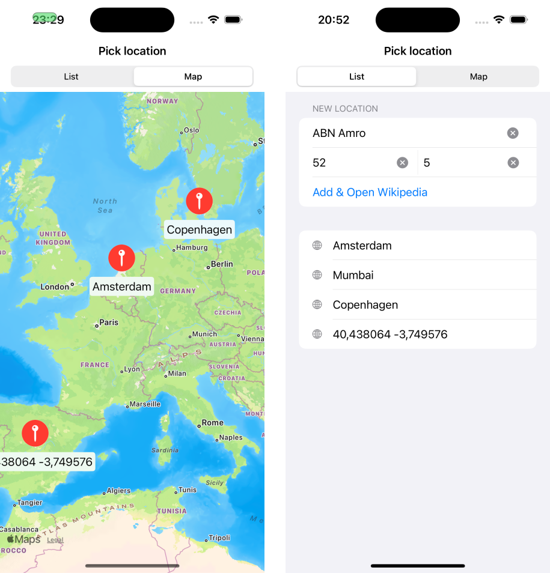
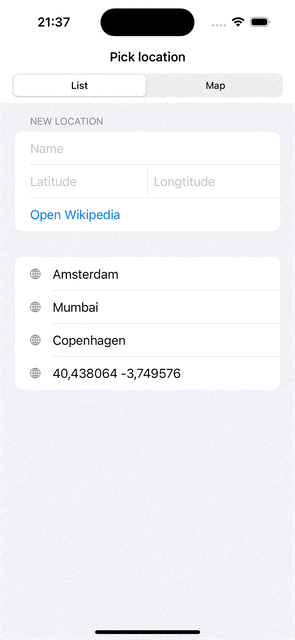

# Igor Vedeneev test assignment for ABN AMRO

  

## Contents
- App which allows to open Wikipedia's app places tab via deeplink with coordinates
- [Modified Wikipedia app](https://github.com/ivedeneev/wikipedia-ios)
- [Changes to Wikipedia app](https://github.com/ivedeneev/wikipedia-ios/pull/1/files)

## How to use it
- Build & run Wikipedia app from the [source code](https://github.com/ivedeneev/wikipedia-ios)
- Run ABNLocation picker app (this repo)
- Enter location manually and open it or select location from the list(or map)

## Features

### List of locations 
- Add location manually and open Wikipedia app with this location
- Display list of predefined locations and user-entered location
- If selected stored location: user get redirected immidiately to Wikipedia app
- If selected random location: user needs to press "Open Wikipedia button on top (see screenshots above)"

### Map
- Displays current user location on first appear* (see limitations)
- Display predefined and user entered locations on the map
- Select and open Wikipedia app with selected location
- Map remembers its camera position and selected location when we are switching back to it from the list view

### Common
- Detect if Wikipedia app is installed or not
- Validate manually entered coordnates
- Supports english localization
- Dark mode support
- Dynamic type support
- Voice over support (partial)

## Known issues and limitations
- Current user location is hardcoded to Amsterdam (see `MockLocationManager`)
- Locations input history is not persisted between app launches (only within current launch)
- Minor visual glitch when switching between list and map when Wikipedia app is not installed
- Visual glitch when selecting exsiting location on the map (SwiftUI `Map` bug, https://developer.apple.com/forums/thread/739782)
